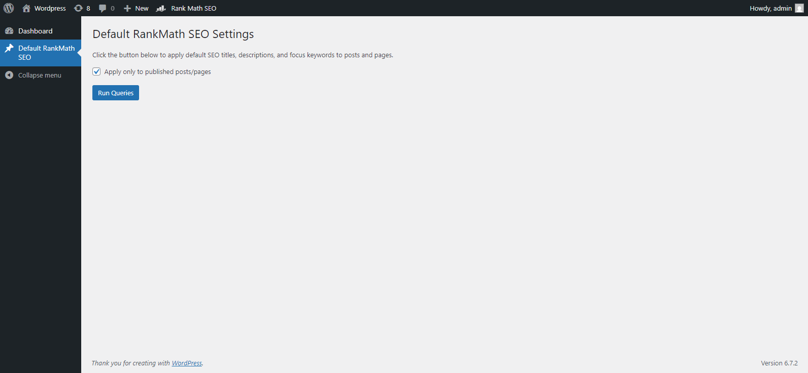
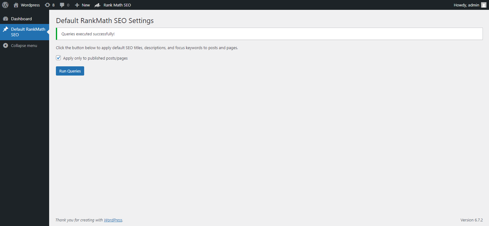

# Default RankMath SEO Settings Plugin

A WordPress plugin to automatically apply default SEO titles, descriptions, and focus keywords to posts and pages using RankMath SEO. Includes an option to apply settings only to published posts/pages or to all posts/pages. Does not overwrite existing SEO values.

---

## Features

- **Default SEO Titles**: Automatically sets the RankMath SEO title to the post title if not already set.
- **Default SEO Descriptions**: Automatically sets the RankMath SEO description to the post title if not already set.
- **Default Focus Keywords**: Automatically sets the RankMath focus keyword to the post title if not already set.
- **Flexible Options**:
  - Apply settings **only to published posts/pages**.
  - Apply settings to **all posts/pages** (regardless of status).
- **Duplicate Prevention**: Ensures no duplicate SEO meta values are inserted.
- **Easy to Use**: Includes a simple admin interface with a button to run the queries.

---

## Installation

1. **Download the Plugin**:
   - Download the plugin as a `.zip` file from the [Releases](https://github.com/alinrzv/default-rankmath-seo/releases) page or clone the repository into your `wp-content/plugins/` directory:
     ```bash
     git clone https://github.com/alinrzv/default-rankmath-seo.git
     ```

2. **Install the Plugin**:
   - Go to your WordPress admin dashboard.
   - Navigate to **Plugins > Add New > Upload Plugin**.
   - Upload the `.zip` file or activate the plugin if you cloned the repository.

3. **Activate the Plugin**:
   - Once installed, activate the plugin from the **Plugins** page.

---

## Usage

1. **Access the Plugin**:
   - After activation, go to **Default RankMath SEO** in the WordPress admin menu.

2. **Run the Queries**:
   - Check or uncheck the **"Apply only to published posts/pages"** checkbox based on your preference.
   - Click the **Run Queries** button to apply default SEO titles, descriptions, and focus keywords to your posts and pages.

3. **Check Results**:
   - After running the queries, check your posts and pages to ensure the default SEO values have been applied.

---

## Screenshots

1. **Admin Page**:
   
   *The admin page with the "Apply only to published posts/pages" checkbox and the "Run Queries" button.*

2. **Success Notice**:
   
   *A success notice displayed after the queries are executed.*

---

## Frequently Asked Questions (FAQ)

### 1. **Does this plugin overwrite existing SEO values?**
   - No, the plugin only inserts default values for posts/pages that do not already have RankMath SEO titles, descriptions, or focus keywords set.

### 2. **Does this plugin work with pages?**
   - Yes, the plugin applies to both **posts** and **pages**. You can also add custom post types by modifying the `$post_types` array in the plugin code.

### 3. **Can I run the queries multiple times?**
   - Yes, you can run the queries multiple times. The plugin ensures no duplicate values are inserted.

### 4. **Is this plugin compatible with other SEO plugins?**
   - This plugin is specifically designed for RankMath SEO. It may not work as expected with other SEO plugins.

---

## Changelog

### 1.0
- Initial release of the plugin.
- Added functionality to apply default SEO titles, descriptions, and focus keywords.
- Added an option to apply settings only to published posts/pages or to all posts/pages.
- Ensured the plugin does not overwrite existing SEO values.

---

## Contributing

Contributions are welcome! If you'd like to contribute to this project, please follow these steps:

1. Fork the repository.
2. Create a new branch for your feature or bug fix.
3. Make your changes and commit them with clear messages.
4. Submit a pull request.

---

## License

This plugin is licensed under the **GNU General Public License v2.0**. See the [LICENSE](LICENSE) file for more details.

---

## Support

If you encounter any issues or have questions, please [open an issue](https://github.com/alinrzv/default-rankmath-seo/issues) on GitHub.

---

## Credits

- Developed by **[BestDigital.ro](https://github.com/alinrzv)**.
- Built for the WordPress community.

---

Enjoy the plugin! If you find it useful, consider giving it a ⭐ on GitHub.